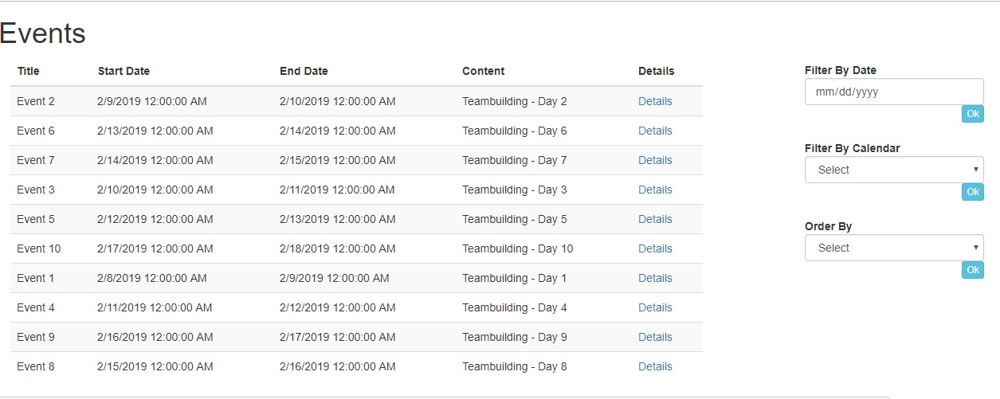
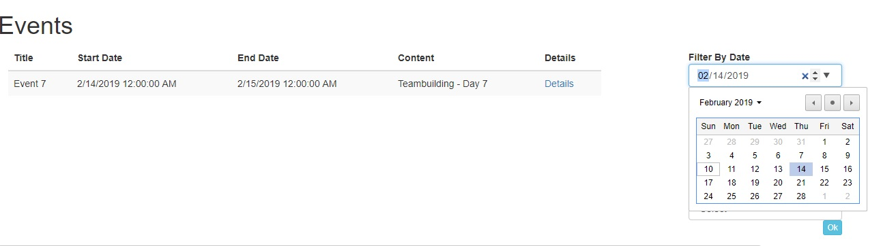
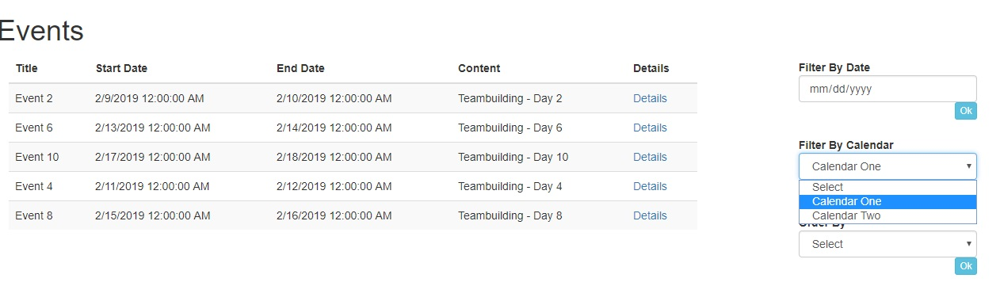
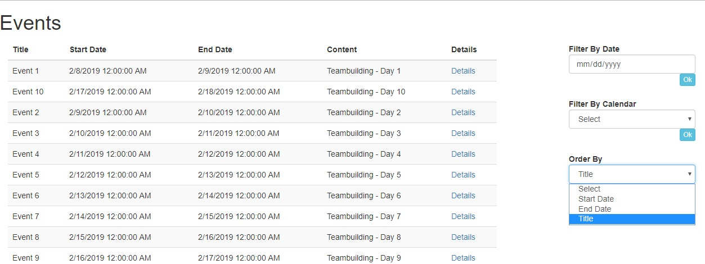
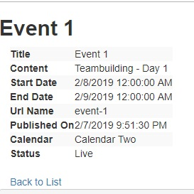
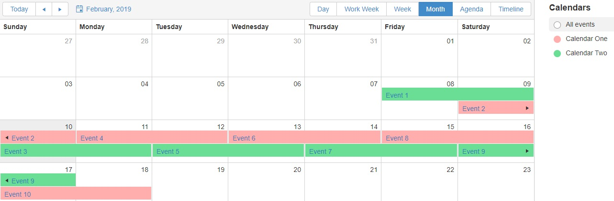

## Sitefinity Widget Task
Part 1:
Create 2 calendars in Sitefinity through the backend administrative UI. 
Using Sitefinity’s API, create 10 events with consequent dates, each finishing a day after it has began. 
Assign the events with odd starting dates to the first calendar, and the events with even starting dates to the second calendar.  
Create an MVC widget to display the events. 
The widget should be able to display the events filtered by: 
- Calendar 
- Start date 

Bonus:  
Implement sorting options in the widget. 
The sorting options should include: 
1. Start date 
2. End date 
3. Title 

Part 2:
Prepare written documentation about the approach for solving the task in Part 1 

## Screenshots:

